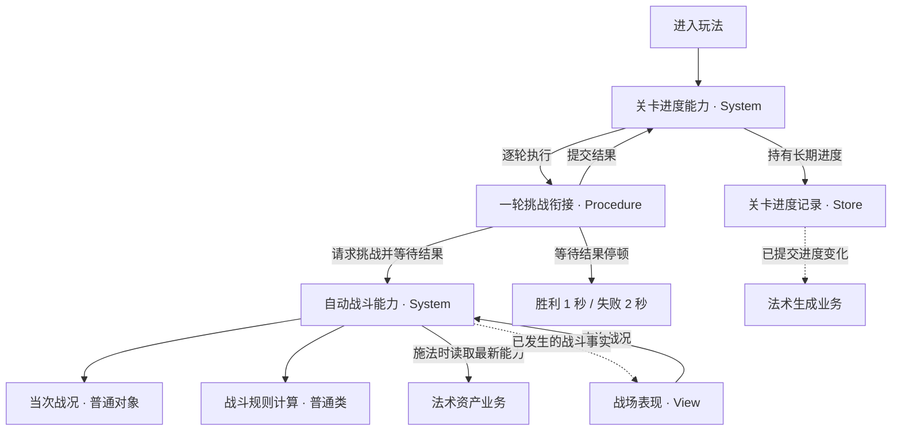

# AutoBattle 角色设计

日期：2026-09-07。状态：角色方案已实施，Unity 自动测试通过；产品暂定规则见需求提取 §5。

本文完全替代上一版实现导向的重构方案。设计输入仅为 [AutoBattle 需求提取](AutoBattle需求提取.md) 和已更新依赖中的 JulyArch 角色约定，不引用现有业务类、方法、测试、MDD 或迁移清单。

## 1. 框架依据与依赖更新

- 项目已更新为独立发布标签 `com.july.arch@0.1.2`。
- 锁定提交：`b0d5ab30494f41d9dc77501c69e633a7738ef9ff`。
- 约定来源：[已安装 JulyArch README](../../Library/PackageCache/com.july.arch@b0d5ab3049/README.md)；[发布标签中的 README](https://github.com/XjVoilin/JulyFramework/blob/com.july.arch%400.1.2/Packages/com.july.arch/README.md)。
- Unity 已更新 packages-lock.json 并解析到相应包缓存，包记录 `errors: []`。包解析验证不代表玩法验收通过。
- 本次只更新 JulyArch；其日志、事件和 UniTask 依赖已由项目依赖满足，没有批量升级其他包。

JulyArch 按职责定义角色：System 管理模块能力、业务过程和运行数据；Store 管理需要独立维护的业务数据；Procedure 编排包含等待或表现的单次流程；View 负责显示和输入；普通类隐藏内聚的复杂度。它不要求每个模块具备全部角色，也不要求成套只读接口。

## 2. 从需求划分业务能力

| 能力 | 负责回答的问题 | 需求依据 |
|---|---|---|
| 单次自动战斗 | 指定关卡内发生什么，攻击如何生效，何时产生胜负？ | AB-02—13、16—19 |
| 连续关卡挑战 | 应挑战哪关，结束后等待多久，重试或下一关，长期进度如何改变？ | AB-01、14—18 |

划分理由是数据含义和生命周期：同一关可以反复产生全新战况，最高关进度却必须跨启动保留。战斗规则不需要理解挂机效率公式；连续挑战只需要本次关卡与胜负，无需理解命中、护盾和选敌。

法术资产业务负责拥有、装备、培养及合法性，战斗只消费当前装备的有效能力。法术生成业务根据已提交进度调整效率并独立计算离线收益。

## 3. 角色与成立依据

以下名称是从需求推导的业务角色称呼，实现映射见 §8。

| 角色 | JulyArch 类型 | 职责 | 成立依据 |
|---|---|---|---|
| 自动战斗能力 | System | 建立指定关挑战、推进战斗、使用最新装备、管理当前战况和胜负、暂停续战及结束 | 持续业务能力，拥有一次运行的创建、变化和结束；AB-02—13、16—18 |
| 关卡进度能力 | System | 决定当前挑战关、接收有效结果、提交进度且不越界、管理连续挑战启停 | 规则判断和跨局业务操作；AB-01、14—15、18 |
| 关卡进度记录 | Store | 持有最高关等跨启动记录，完整更新后通知变化 | 数据独立于任何一局存在；AB-15、18 |
| 一轮挑战衔接 | Procedure | 请求一次当前关挑战、等待结果、协调进度提交和结果停顿，结束后允许下一轮 | 真实异步先后顺序和可取消等待；AB-14—15 |
| 战场表现 | View | 显示书、敌人、法术、冷却，播放受击、死亡和结果反馈 | 业务事实需要转为玩家可见反馈；AB-19 |
| 当次战况 | 普通数据对象 | 挑战身份、出生进度、书、敌人、冷却、攻击、效果和终态 | 数据只属于当前挑战；AB-16、18 |
| 战斗规则计算 | 普通类 | 内聚选敌、施法生效、护盾/减速和同刻胜负顺序 | 这些规则共同决定战斗结果，具有独立可验证的复杂度；AB-06—13 |

自动战斗没有自己的 Store：没有战况脱离当前运行后仍需独立维护的需求。多个消费者读取战况不会改变其归属。

关卡进度能力管理连续挑战是否启用及取消资源，每轮执行一个一次性的 Procedure。循环属于长期能力内部行为，不另设仅转发循环的管理 System。Procedure 不逐次计算移动、命中和施法，也不持有第二份当前战况。

普通类暂定到“当次战况”和“战斗规则计算”。单位、冷却和效果需要数据表达，但需求尚不足以规定为每种对象设置一个框架角色或一套接口。进一步类型划分留给详细设计。

## 4. 关系与修改责任

自动战斗能力是当次战况的业务修改所有者，可以委托内部普通类直接修改同一对象。View 读取战况，不由动画完成回调决定业务伤害。关卡进度能力接受结果并提交进度；Store 维护完整记录，不判定通关、不编排等待。

命中、死亡、施法、胜负等短暂事实必须能被表现消费，不能仅凭某个渲染时刻仍存在的对象推断全部反馈。详细设计再选择即时事件或当次推进的事实集合，不建立持久事件日志。

跨模块顺序使用直接调用和流程等待表达。事件用于独立观察者响应已提交变化，不以订阅顺序决定进度更新。

## 5. 能力契约

| 业务入口 | 输入和结果 | 责任约定 |
|---|---|---|
| 开始连续挑战 | 进入当前玩法 | 进度已恢复，同一玩法会话只存在一条连续挑战流程 |
| 运行一次指定关挑战 | 关卡 → 本次挑战身份、关卡与唯一胜负 | 建立全新战况；正常胜负只结束一次；离开玩法可取消，取消不是失败 |
| 查询当前战况 | 当前运行对象或无战况 | 每次刷新或跨等待后重新查询，旧引用不会自动转向下一局 |
| 接受挑战结果 | 本次身份及胜负 → 已提交进度 | 失败不前进，胜利在上限内前进，一次结果只提交一次 |
| 暂停与恢复战斗时间 | 应用前后台变化 | 保留同一局，后台不推进，回来续战且不补算后台时间 |
| 结束玩法 | 当前玩法会话 | 结束等待、停止推进、释放运行与流程资源，不虚构胜负 |

此处不固定方法签名、完成源、时钟或每帧事件数量。单局等待属于 System 的能力；Procedure 组合这个能力与进度操作、停顿，不替 System 管理内部运行态。

## 6. 生命周期设计建议

以下具体组织是设计建议，区别于已经提取的产品规则：

- 无挑战时查询返回无战况；新挑战建立后对外可读。
- 正常终局后冻结该局战况，结果停顿期间供显示，下一局再替换；离开玩法时清理。保留结束对象服务于结果反馈，不是长期玩家记录。
- 取消结束当前玩法活动，不伪造失败，不撤销已经提交的进度。
- 已发攻击保存发起时必要的能力参数，使换装/升级不追溯生效；本轮按 Q-04 的暂定方案冻结目标，死亡后跳过。
- 前后台切换保留原挑战，恢复后继续推进；本轮结果停顿也冻结，见 Q-01。
- 本轮胜利确认后、停顿前提交进度，使生成效率及时更新；该实施选择记录为 Q-06 暂定规则。

## 7. 可调整的实施决定

需求提取 §5 区分了用户确认和本轮暂定规则，后续修改这些规则无需重新划分长期记录与临时战况的所有者。

模拟频率、时间推进策略、类文件数量、集合表达和配置表结构留到详细设计决定，本轮先确定业务角色及其修改责任。

验证应围绕需求场景，使一次战斗、一次挑战衔接及长期进度提交可分别验证；不为测试额外创建框架角色。

## 8. 本轮实现与验证

| 业务角色 | 实现 | 关键责任 |
|---|---|---|
| 自动战斗能力 | AutoBattleSystem | 唯一持有 CurrentRun，创建、取消、清理及唯一完成；维护前台时间 |
| 战斗规则计算 | BattleSimulation | CreateRun 返回新局；Advance 显式接收本次战况；不保留第二份 CurrentRun |
| 当次战况 | BattleRun 及书、敌人、冷却、攻击、效果普通对象 | 直接读取属性与标准集合；必要规则方法封装局部修改，无成套领域只读接口 |
| 关卡进度能力 | StageProgressionSystem | 校验本次已完成结果和重复提交，决定下一关；管理连续流程启停 |
| 长期关卡记录 | StageProgressionStore | 持有记录、完整写入和通知，不读取关卡配置、不选择下一关 |
| 一轮挑战衔接 | StageChallengeProcedure | 等待一次战斗，交 System 提交结果，再等待前台结果停顿 |
| 显示与音频 | WindowData、战场 View、音频表现 | 每次刷新查询当前战况，无战况时清理；正常结束显示末帧 |

每个固定模拟步发布状态，再在终局发布一次结束事实并完成等待。运行中取消使等待抛取消并清空战况；模拟异常经同一个等待通道报告并释放占用。旧帧保留本次完成源身份，取消中产生的新局不会被旧帧继续推进。

运行程序集与测试程序集编译通过，0 警告、0 错误。Unity EditMode 共 21 项测试通过，含跨帧 UnityTest：末次命中优先、换装和升级冻结、无目标护盾等待、长帧攻击可观察、取消中重入、后台续战、异常释放、唯一进度提交、最大关和结果停顿取消。测试使用独立内存 ArchContext 与配置副本，不写玩家存档。尚未宣称真机性能或完整视觉验收通过。

